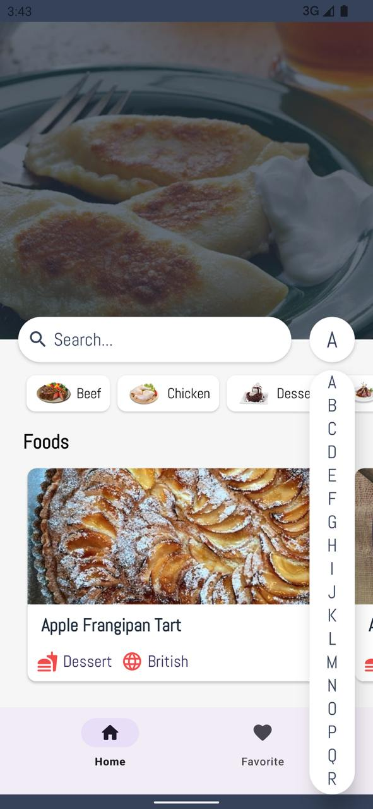
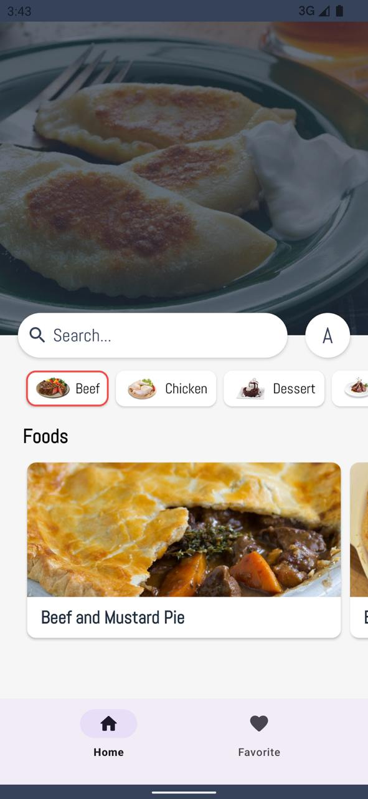
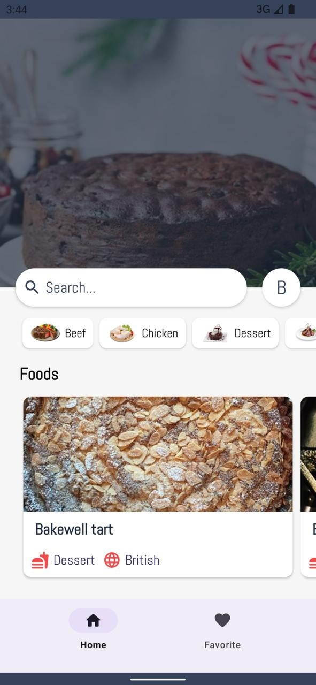
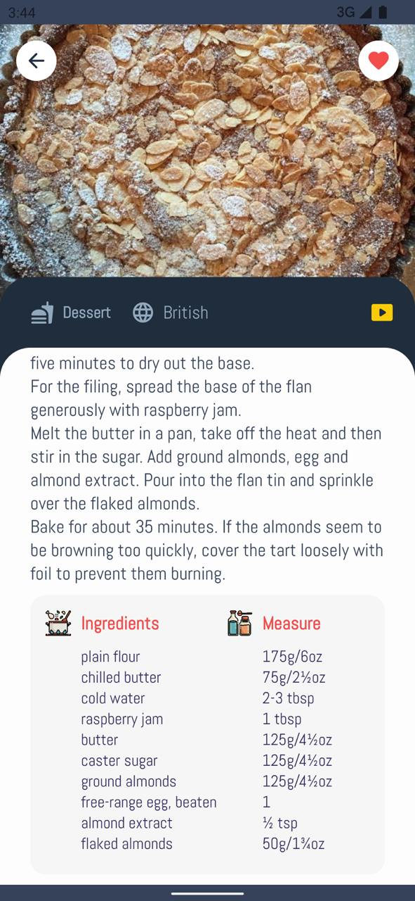
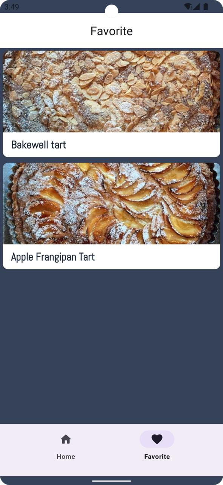

# FoodAppMVP

FoodAppMVP is a simple food app presented as an MVP-style Android project. This repository currently contains the README, screenshots, a license file, and an APK download link, but the application source code is not included in the repository snapshot.

## Download

- [Download Food App](https://drive.google.com/file/d/14piMwWNlQhdkCXQ5huO5W7Rv98WQCJMf/view?usp=drive_link)

## Screenshots

<p align="center">
  
  
  
</p>

<p align="center">
  
  
</p>

## App Overview

Based on the available screenshots and README notes, this is a food-ordering style mobile app with an MVP architecture concept. The visible app flow appears to include food browsing and related food-app screens, but the implementation code is not currently part of this repository.

## Repository Contents

```text
.
├── README.md
├── LICENSE
└── images
    ├── pic1.jpeg
    ├── pic2.jpeg
    ├── pic3.jpeg
    ├── pic4.jpeg
    └── pic5.jpeg
```

## Notes

The Android/Kotlin source code is not present in this repository. If the MVP implementation is added later, this README can be expanded with architecture details, modules, dependencies, setup steps, and build instructions.
